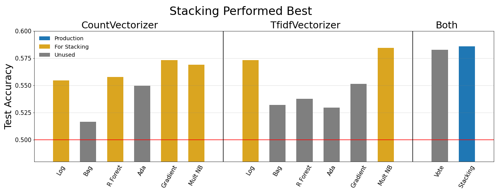

# Problem Statement

#### Background
*Reddit* is a forum like website that is partitioned into many communities called *subreddits*. These subreddits, often prefixed with 'r/', provide a space for people all over the world to interact with one another and share things related to the specific subreddit. Some examples of subreddits or r/explainlikeimfive, r/cooking, and r/SanFrancisco.
 
Since anyone can create a subreddit, many subreddits exist that appear to serve the same purpose on the surface. Usually these subreddits will still have their own differences that distinguish them from one another and justify their existence.

For example, there are several subreddits related to the city of Seattle: r/Seattle and r/SeattleWA. Someone who has not explored these subreddits very thoroughly may have a question to ask about Seattle and not know which subreddit would be the most fitting to post in.

#### Problem Statement
In this project we:
- explore the text data from posts on r/Seattle and r/SeattleWA
- try to identify notable ways in how these two subreddits differ
- and build classification models to try and predict if a post is more likely to come from r/Seattle or r/SeattleWA

Since r/Seattle and r/SeattleWA are likely to have very similar users and posts (there are certainly people who participate in both subreddits), it will be challenging to build a model that can perform strong predictions. We will deem our model successful if it can correctly classify which subreddit a post belongs to more than 60% of the time.

---

# Summary

We collected data from nearly 5,000 total posts across the subreddits r/Seattle and r/SeattleWA (~2,500 each) using [pushshift API](https://github.com/pushshift/api). Using regular expressions and `nltk` we cleaned the text data and collected sentiment analysis. With the cleaned text data we used CountVectorizer to obtain word frequencies across each subreddit post. To identify which words best distinguished the two subreddits, for each subreddit we ranked each word by the frequency it appeared in that subreddit. Then we subtracted each words ranking in one subreddit by its ranking in the other. This gave us a metric for seeing which word appeared frequently in one subreddit but not the other. Below we see two visuals showing the words that appeared much more frequently in r/Seattle than r/SeattleWA and vice versa. The primary takeaway was that posts on r/SeattleWA were more likely to have politically Conservative sentiment.

Next we built several models to classify posts into different subreddits, trying both CountVectorizer and TfidfVectorizer. Ultimately, we landed on StackingClassifier with base models of Random Forest, Gradient Boosting, Logistic Regression, and Multinomial Naive Bayes. This model scored 59% accuracy on the test set

---

# Conclusion

Our goals for this project were to:
- explore the text data from posts on r/Seattle and r/SeattleWA
- try to identify notable ways in how these two subreddits differ
- and build classification models to try and predict if a post is more likely to come from r/Seattle or r/SeattleWA

We were able to analyze some characteristics within the r/SeattleWA subreddit that distinguished it from r/Seattle. The main takeaway was that r/SeattleWA showed a lot of reason to believe its users are generally more Conservative than the users on r/Seattle. This can be seen by the significant difference in frequency of the following words, all of which appeared much more frequently in r/SeattleWA:
- mask, tax, drug, clean, homeless, report, crime, law, wear, gun

With r/Seattle, the most common words appear to be more general suggesting the subreddit consists of more general residents of Seattle.
- board, food, game, event, dog, line, blue

In terms of our production model, we tried numerous models and the one that performed the strongest was a StackingClassifier whose first level estimators consisted of a:
- random forest with CountVectorizer
- Gradient Boosting with CountVectorizer
- multinomial naive Bayes with CountVectorizer
- logistic regression with TfidfVectorizer
- multinomial naive Bayes with TfidfVectorizer

We stated that our original goal was an accuracy score exceeding 60%. Unfortunately, our production model slightly missed the target with an accuracy score of 58.6%. Although we were able to identify a rough distinction between the two subreddits, there are many similarities between them. It was not surprising that our models had some difficulty predicting between the two, especially with a using bag-of-words approach like CountVectorizer and TfidfVectorizer.

For future explorations, I would recommend analyzing words strictly in one subreddit and not the other. In this project, we looked at the top 2,000 words of each subredit and examined the words in common. This completely ignored any words roughly 700 words (350 from each subreddit). Most of these words would likely be uninteresting, but there may be a few illustrative gems.

Other topics we did not thoroughly examine were bi-grams and tri-grams. I looked into these very lightly, but not of the work was led to anything deep enough to include in the project. There may be some insights to draw here.

And finally, we never used comment data in our analysis. Because these subreddits share many of the same users, identical posts certainly appear on both subreddits occassionally. It could be interesting to identify examples of such posts and analyze how the comment data differ from one subreddit to the other.